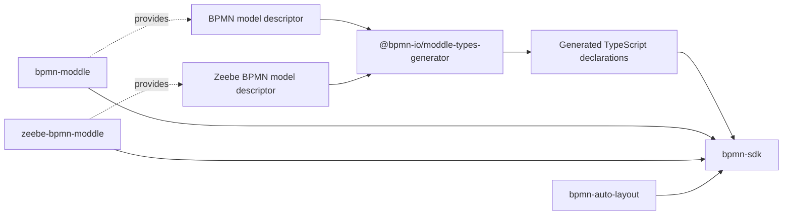

# bpmn-sdk

`bpmn-sdk` is a TypeScript library for creating and safely editing BPMN 2.0
and Camunda 8 / Zeebe models. It lets generator scripts and applications work
with BPMN semantics and exact element IDs instead of manipulating XML, then
writes verified BPMN XML.

Use it when your code must generate a process, make a deliberate change to an
existing model, or safely persist a BPMN file. `Bpmn` is the single public
entry point for fluent construction, exact-ID editing, descriptor-backed
validation, deterministic layout, semantic verification, and atomic output.

## Why bpmn-sdk?

- **Work with BPMN, not XML.** Create topology, configure Zeebe extensions,
  and target existing elements through typed APIs and exact IDs.
- **Keep changes deliberate.** Topology, joins, loop targets, branch
  conditions, and default flows are explicit; the SDK does not infer them.
- **Write without silent corruption.** Before a file is replaced, `write()`
  serializes, reloads, verifies semantics, and writes atomically. It rejects
  ambiguous IDs, invalid containment or connections, and unsupported extension
  data.

It is a higher-level safety layer over `bpmn-moddle`, not a replacement for
the BPMN or Zeebe moddle descriptors.

## Architecture



`bpmn-sdk` builds on `bpmn-moddle` and ships with the Zeebe descriptor profile
enabled by default. At SDK build time, the bundled BPMN and Zeebe descriptors
produce the TypeScript declarations used by its typed API. At runtime,
`bpmn-moddle` and the enabled Zeebe profile parse, create, validate, and
serialize model elements; applications importing the package do not run the
type generator.

## Install

```sh
npm install @philippfromme/bpmn-sdk
```

Requires Node.js 20.12 or later.

## Generate a process

```ts
import { Bpmn } from "@philippfromme/bpmn-sdk";

const process = await Bpmn.createProcess("approval-flow", {
  name: "Approval flow"
});

await process
  .startEvent("start", { name: "Request submitted" })
  .userTask("review", { name: "Review request", formId: "review-request" })
  .exclusiveGateway("approved", { name: "Approved?" })
  .branch("yes", (branch) =>
    branch
      .condition("= approved")
      .serviceTask("notify", {
        taskType: "send-email",
        retries: "3",
        inputs: [{ source: "=requester.email", target: "email" }]
      })
      .endEvent("done")
  )
  .branch("no", (branch) => branch.defaultFlow().endEvent("rejected"))
  .write({ output: "approval-flow.bpmn" });
```

`Bpmn` uses caller-supplied IDs, creates executable processes by default, and
keeps topology explicit. Joins, loop targets, branch conditions, and default
flows are never inferred.

The fluent layer covers common BPMN topology: exclusive, parallel, inclusive,
and event-based gateways; intermediate and boundary events; timers, messages,
errors, escalations, signals, and links; loops; subprocesses and ad-hoc
subprocesses. It also supports common Zeebe service-task, human-task,
called-process, called-decision, script, and multi-instance configuration.

### Fluent Zeebe configuration

Task options configure the Zeebe extensions associated with their BPMN type:

```ts
await process
  .startEvent("start")
  .userTask("review", {
    form: { formId: "review-request" },
    humanTask: {
      assignment: { candidateGroups: "reviewers" },
      priority: "=request.priority",
      schedule: { dueDate: "=request.dueDate" }
    }
  })
  .callActivity("fulfil", {
    calledElement: { processId: "fulfil-request" }
  })
  .businessRuleTask("decide", {
    calledDecision: { decisionId: "approval", resultVariable: "decision" }
  })
  .scriptTask("prepare-response", {
    script: { expression: "=decision.approved", resultVariable: "approved" }
  })
  .multiInstanceLoop({
    cardinality: "=count(items)",
    zeebe: { inputCollection: "=items", inputElement: "item" }
  })
  .endEvent("done");
```

`userTask` continues to accept `formId` as a shorthand for
`form: { formId }`. Use `humanTask.listeners` for user-task lifecycle
listeners when the listener's event type and job type are known.

## Generate a collaboration

Use a separate builder for pools and message flows:

```ts
const collaboration = await Bpmn.createCollaboration("order-collaboration");

await collaboration
  .process("buyer-process", { isExecutable: true })
  .process("seller-process")
  .participant("buyer", { name: "Buyer", processId: "buyer-process" })
  .participant("seller", { name: "Seller", processId: "seller-process" })
  .message("order-request", { name: "Order request" })
  .messageFlow("request", {
    sourceId: "buyer",
    targetId: "seller",
    messageId: "order-request"
  })
  .write({ output: "order-collaboration.bpmn", layout: "none" });
```

`CollaborationBuilder` deliberately does not share cursor state with
`ProcessBuilder`. Participants, messages, and message-flow endpoints use exact
IDs. Both builders expose their shared editor through `editor()` when a
script needs exact-ID edits before writing.

## Edit an existing model

`Bpmn.open()` returns the universal editor. It uses descriptor-checked properties,
exact IDs, and typed contained children instead of XML manipulation.

```ts
import { Bpmn } from "@philippfromme/bpmn-sdk";

const model = await Bpmn.open("customer-support.bpmn");
const task = model.element<"bpmn:ServiceTask">("SendReply");

task.setName("Send customer reply");
task.extensions.ensure("zeebe:IoMapping").addInput({
  source: "=customer.id",
  target: "customerId"
});

await model.write({
  output: "customer-support.edited.bpmn",
  layout: "none"
});
```

The model API provides scalar and ordinary-reference edits, typed contained
child traversal/create/remove, collision-safe ID renaming, sequence-flow
connect/rewire/remove, and safe boundary-event attachment. It also exposes
Zeebe helpers for forms, subscriptions, called decisions/elements, scripts,
and multi-instance settings.

To resume fluent topology construction after exact-ID editing, select both
targets explicitly; no cursor is inferred:

```ts
await model
  .continueProcess("CustomerSupport")
  .at("SendReply")
  .endEvent("ReplySent")
  .write({ output: "customer-support.completed.bpmn" });
```

The selected node must be a flow node directly contained by the selected
process. Continuing from an end event is terminal, and an existing gateway
default flow remains claimed.

Custom moddle extensions require a loaded descriptor:

```ts
const model = await Bpmn.open("model.bpmn", {
  extensions: ["acme=acme-moddle.json"]
});

model.element("Task_1").extensions.ensureCustom("acme:Settings", {
  priority: "high"
});
```

## Create an editable model

```ts
import { Bpmn } from "@philippfromme/bpmn-sdk";

const model = await Bpmn.create();
const process = model.process({ name: "Customer email" });
const task = model.create("bpmn:UserTask", { name: "Send customer email" });
model.append(process, task, "flowElements");
task.configureForm({ formId: "customer-email" });
await model.write({ output: "customer-email.bpmn" });
```

## Writing and safety

`write()` is the only serialization boundary. It serializes, reloads,
verifies BPMN/Zeebe semantics, and writes atomically. It rejects ambiguous IDs,
foreign elements, invalid containment or connections, malformed BPMN, and
unsupported extension data rather than silently dropping it.

```ts
await model.write({
  output: "edited.bpmn", // required for Bpmn.create()
  layout: "auto",        // default; regenerate Diagram Interchange
  validate: true,        // default
  force: false           // default; refuses replacement
});
```

Write results include output and semantic hashes plus semantic change
information. Presentation-only Diagram Interchange does not affect semantic
hashes. Use `layout: "none"` to skip `bpmn-auto-layout`: existing Diagram
Interchange is preserved unchanged, and a model without Diagram Interchange
remains without it. Use the default `layout: "auto"` for generated models that
need a deterministic diagram.

## Examples

The executable examples cover the main supported scenarios:

- `examples/straight-through-service-flow.mjs`
- `examples/human-workflow.mjs`
- `examples/exception-timeout-handling.mjs`
- `examples/collaboration.mjs`
- `examples/multi-instance-work.mjs`

```sh
npm run build
node examples/straight-through-service-flow.mjs generated-flow.bpmn
```

For a concise, agent-facing operating guide, see
[`examples/agent-skill/SKILL.md`](examples/agent-skill/SKILL.md). It is a
reference skill to adapt for an agent platform; installing this package does
not automatically activate it.

## Verification

```sh
npm test
npm run lint
npm run test:generators
```

`test:generators` executes each example and gates script size, execution time,
write success, semantic fidelity after reload, and local BPMN/Zeebe
descriptor compatibility. It does not replace validation against an external
Camunda runtime.

## API scope

The exact-ID editor returned by `Bpmn.open()` and `Bpmn.create()` supports
bundled BPMN, BPMNDI/DC/DI, and Zeebe descriptor-backed properties. The fluent
API is intentionally curated for common topology and Zeebe task configuration;
it is not a mirror of every descriptor.

The fluent API does not currently expose event subprocesses, execution
listeners, linked resources, conditional filters, or modeler-template metadata.
