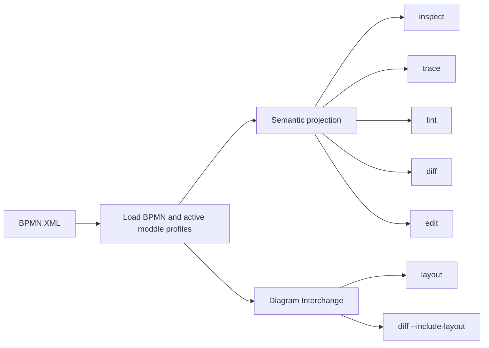
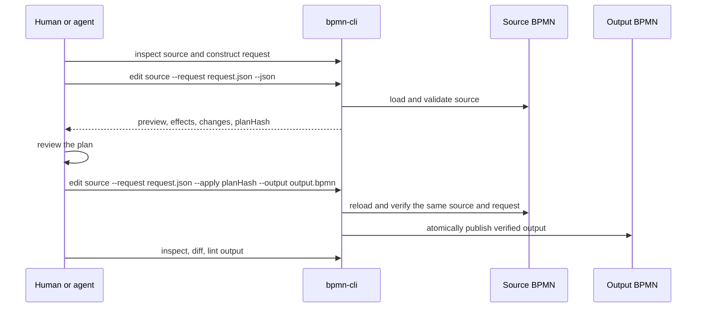

# bpmn-cli Overview

`bpmn-cli` is a tool for reading, checking, comparing, and safely changing BPMN
models. It is built for agents, but its rules are useful to humans too:

- Ask for a small, exact piece of model information.
- Treat BPMN business semantics and diagram presentation as different things.
- Preview edits before writing unless a trusted workflow explicitly uses unreviewed apply mode.
- Apply only the exact preview that was reviewed.
- Verify the output after it is written.

The CLI reads BPMN XML, but it does not make XML its main interface. Its output
uses BPMN concepts such as processes, activities, gateways,
events, sequence flows, and Zeebe extension data.

## The two parts of a BPMN file

A BPMN file contains two related but separate layers.

| Layer | Includes | Used by |
| --- | --- | --- |
| Business semantics | Processes, tasks, events, gateways, flows, conditions, and execution extension data | `inspect`, `trace`, `lint`, `diff`, and `edit` |
| Diagram Interchange (DI) | Shapes, bounds, waypoints, labels, colors, and layout | `layout`, or `diff --include-layout` |

By default, semantic commands ignore DI. Moving a shape or changing a color
does not make a semantic diff. Conversely, `layout` intentionally replaces DI
and proves that the business semantics did not change.



## What each command answers

| Command | Question it answers | Does it write BPMN? |
| --- | --- | --- |
| `inspect` | What is in this process, scope, or element? | No |
| `trace` | What BPMN behavior is reachable from, to, or between these elements? | No |
| `lint` | Does this model violate the selected BPMN policy rules? | No |
| `diff` | What business semantics changed between these two models? | No |
| `edit` | What exact change would this request make, and can it be safely applied? | Preview: no. Apply: yes. |
| `layout` | Can this model get a fresh diagram layout without changing semantics? | Yes |
| `capabilities` | What commands, profiles, limits, and engines are available? | No |

Start with `capabilities --json` or `<command> --help` when the command shape is
unknown.

## Read before changing

IDs and properties come from the loaded model. Do not infer them from the XML
spelling or from a rendered diagram.

```sh
# Find processes and their IDs.
bpmn-cli inspect model.bpmn --json

# Inspect one process, then a specific task or flow.
bpmn-cli inspect model.bpmn --process Process_1 --json
bpmn-cli inspect model.bpmn --element Task_Approve --json
bpmn-cli inspect model.bpmn --element Flow_Approve --json
```

Use `trace` when a change affects behavior beyond one element:

```sh
bpmn-cli trace model.bpmn --from Gateway_1 --to Task_Approve --json
```

Tracing returns a bounded BPMN subgraph. It does not simulate execution or
guess which condition will evaluate true.

## Safe editing is a transaction

An edit request is JSON with one or more ordered operations. Supported
operations are `add`, `remove`, `replace`, and `move`. `replace` changes an
existing value, such as an element's `name`, a flow endpoint, or an extension
property; it does not replace the entire BPMN element. Every operation states
what it expects to find before changing it.

Preview is the default. It does all validation in memory and never writes BPMN.
The preview produces a `planHash`, which binds the source bytes, request bytes,
profiles, options, resolved IDs, and planned result. Apply repeats the whole
transaction and accepts only that exact hash.



Example request: change a known property only if it still has the expected
value.

```json
{
  "schemaVersion": "1",
  "operations": [
    {
      "op": "replace",
      "target": "Task_Approve",
      "path": "/name",
      "value": "Approve application",
      "expect": [
        {
          "target": "Task_Approve",
          "path": "/name",
          "equals": "Approve"
        }
      ]
    }
  ]
}
```

Run it in three stages:

```sh
# 1. Preview. This does not write BPMN.
bpmn-cli edit model.bpmn --request rename.json --json

# 2. Apply only the returned planHash, preferably to a new file.
bpmn-cli edit model.bpmn --request rename.json \
  --apply "<planHash>" --output edited.bpmn --json

# 3. Verify the published result.
bpmn-cli diff model.bpmn edited.bpmn --json
bpmn-cli lint edited.bpmn --json
```

If the model, request, selected profiles, or relevant options changed after
preview, apply fails with `STALE_PLAN`. Create and review a new preview; do not
guess or alter the hash.

For a trusted, non-review workflow, `--apply-unreviewed` runs the same validation,
serialization, layout, reload verification, and atomic publication in one
invocation. It skips only external plan review and writes in place by default:

```sh
bpmn-cli edit model.bpmn --request rename.json --apply-unreviewed --json
```

Use it only when the request's preconditions fully express the expected source
state; structural edits and unexpected derived effects are safer to preview.

## Why edits report effects

Some BPMN properties have reciprocal relationships. For example, changing a
SequenceFlow's `targetRef` also changes the target activity's `incoming` list.
The request edits the authoritative property, while the preview reports these
derived effects so they can be reviewed.

For a task inserted into a SequenceFlow, a sound plan normally reports only:

```text
old target incoming: remove old flow
new task incoming: add old flow
new task outgoing: add new flow
old target incoming: add new flow
```

An unexpected effect is a reason to stop and inspect the affected elements
again.

## Output is intentionally bounded

The CLI avoids dumping an entire model by default. It returns small, targeted
JSON documents and keeps normal stdout to 32 KiB. Use the narrowest query that
answers the question:

```sh
bpmn-cli inspect model.bpmn --element Task_1 --json
bpmn-cli inspect model.bpmn --scope Process_1 --limit 25 --json
```

When complete output is genuinely needed, explicitly write an offline artifact:

```sh
bpmn-cli inspect model.bpmn --process Process_1 --all \
  --json --output process.json
```

This makes large reads and writes visible in the command itself.

## Extensions and profiles

Standard Zeebe models activate the bundled Zeebe moddle descriptor
automatically. Custom BPMN extensions need their descriptor supplied to every
related command:

```sh
bpmn-cli inspect model.bpmn --extension acme=acme-moddle.json --json
bpmn-cli edit model.bpmn --extension acme=acme-moddle.json \
  --request edit.json --json
```

Extension data is addressed through loaded descriptor properties, not generic
XML fragments. This keeps changes typed, inspectable, and round-trippable.

## Practical workflow

For most real changes, use this order:

1. `inspect` the process, target elements, and connecting flows.
2. `trace` if the behavior around the change is unclear.
3. Write an edit request with explicit `expect` preconditions.
4. Preview with `edit` and review `changes`, `effects`, and `planHash`.
5. Apply to a separate output file.
6. Verify with targeted `inspect`, semantic `diff`, and `lint`.

This is more deliberate than editing XML directly, but it makes every intended
change reviewable and makes stale or ambiguous edits fail instead of guessing.